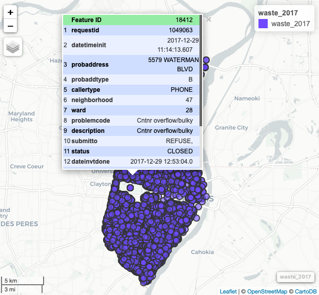
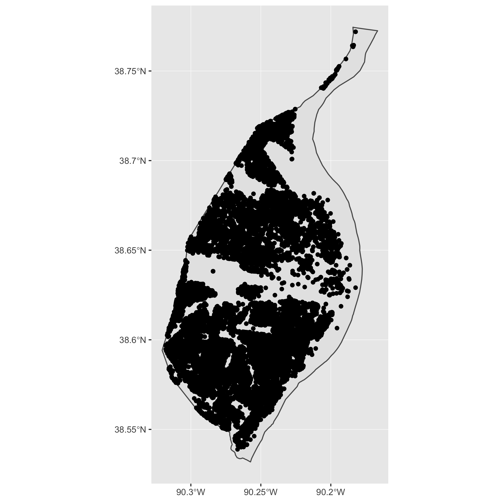

<!-- README.md is generated from README.Rmd. Please edit that file -->

# stlcsb 

[](https://www.tidyverse.org/lifecycle/#maturing)
[](https://travis-ci.org/slu-openGIS/stlcsb)
[](https://ci.appveyor.com/project/chris-prener/stlcsb)
[](https://codecov.io/github/slu-openGIS/stlcsb?branch=master)
[](https://zenodo.org/badge/latestdoi/120821460)
[](https://cran.r-project.org/package=stlcsb)

The goal of `stlcsb` is to provide access to data from the City of
St. Louis [Citizens’ Service
Bureau](https://www.stlouis-mo.gov/government/departments/public-safety/neighborhood-stabilization-office/citizens-service-bureau/index.cfm)
(CSB), the [3-1-1 service](https://en.wikipedia.org/wiki/3-1-1) for the
City of Saint Louis. Residents can contact the number with non-emergency
service requests, and the CSB will dispatch these requests to the
appropriate City agency. `stlcsb` also includes functions for cleaning
and manipulating these data.

## Installation

### Installing Dependencies

You should check the [`sf` package
website](https://r-spatial.github.io/sf/) and the [`stlcsb` package
website](https://slu-openGIS.github.io/stlcsb/) for the latest details
on installing dependencies for that package. Instructions vary
significantly by operating system. For best results, have `sf` installed
before you install `stlcsb`. Other dependencies, like `dplyr`, will be
installed automatically with `stlcsb` if they are not already present.

### Installing stlcsb

The easiest way to get `stlcsb` is to install it from CRAN:

``` r
install.packages("stlcsb")
```

The development version of `stlcsb` can be accessed from GitHub with
`remotes`:

``` r
# install.packages("remotes")
remotes::install_github("slu-openGIS/stlcsb")
```

## Example Usage

`stlcsb` is used for simplified acquisition and processing of St. Louis
CSB Data. In the following example, data is downloaded from the City of
St. Louis, filtered to identify only calls related to waste disposal,
and then projected to an sf object for mapping.

``` r
> library(stlcsb)
> library(dplyr)
>
> csb <- csb_get_data(year = 2017)
trying URL 'https://www.stlouis-mo.gov/data/upload/data-files/csb.zip'
Content type 'application/x-zip-compressed' length 60999726 bytes (58.2 MB)
==================================================
downloaded 58.2 MB

>
> csb_filter(csb, var = problemcode, category = cat_waste) %>%
+   csb_missingXY(varX = srx, varY = sry, newVar = "missing") %>%
+   filter(missing == FALSE) %>%
+   csb_projectXY(varX = srx, varY = sry) -> waste_2017
```

Notice that variable names can be either quoted or unquoted, since
`stlcsb` makes full use of non-standard evaluation.

Once the data are projected, they can be explored with packages like
`mapview`:

``` r
> library(mapview)
> mapview(waste_2017)
```



These data can also be mapped using `ggplot2` once they have been
projected:

``` r
> library(ggplot2)
> ggplot() + 
+   geom_sf(data = waste_2017, color = "red", fill = NA, size = .5)
```



## Contributor Code of Conduct

Please note that this project is released with a [Contributor Code of
Conduct](.github/CODE_OF_CONDUCT.md). By participating in this project
you agree to abide by its terms.
